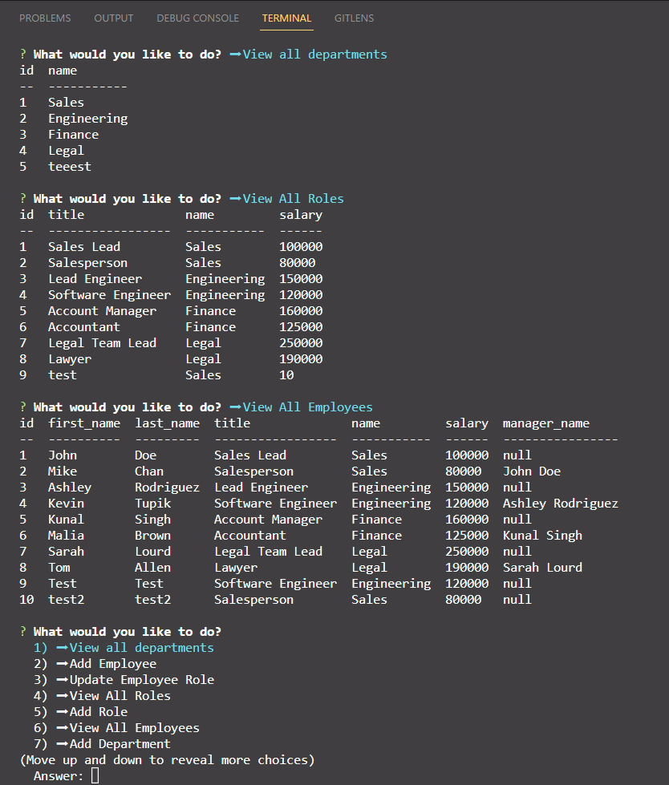

# Employee Tracker []

## Description
Command-line application built from scratch to manage a company's employee database, using Node.js, Inquirer, and MySQL.

## Walkthrough Video
https://drive.google.com/file/d/1U0OigHE-1eW9mTEQRXceUCvSR9aJqQ29/view?usp=sharing

## Table of Contents

- [Installation](#installation)
- [Usage](#usage)
- [License](#license)
- [Questions](#questions)

## Installation
npm i -> mysql -u root -p -> introduce your mysql password -> SOURCE db/schema.sql -> SOURCE db/seeds.sql -> exit; -> node server.js

## Usage
View, Add or Update your complany's employee information by using the command-line application

## License
[]

## Questions
Contact: <andrea.anza3@gmail.com>
